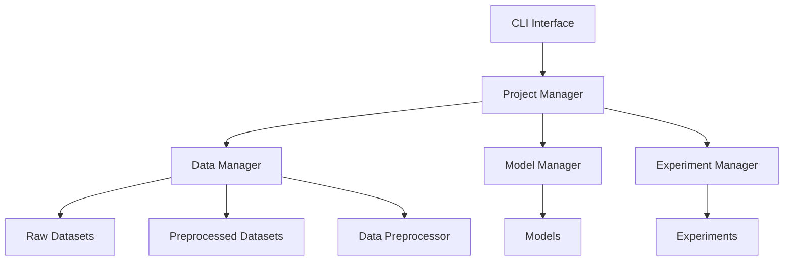

# 总体设计

本文档旨在说明CLI工具UESF（Universal EEG Study Framework）的总体设计。

## 1. 核心理念

UESF的核心理念是"数据驱动，模型无关"。它提供了一套标准化的数据管理和实验流程，使得用户可以轻松地在不同的数据集、模型和训练流程之间切换，而无需修改代码。

UESF的设计遵循以下原则：

- **模块化**: 将数据管理、模型定义和实验流程解耦
- **标准化**: 提供标准化的数据格式和实验流程
- **可扩展**: 支持用户自定义数据集、模型和实验流程
- **易用性**: 提供简单的CLI接口和配置文件

UESF的开发流程遵循敏捷开发原则，采用迭代开发的方式进行开发。

## 2. 架构设计

UESF采用分层架构，将数据管理、模型定义和实验流程解耦。具体架构如下：

## 3. 核心组件

### 3.1 Project Manager

Project Manager负责管理项目。每个项目包含以下组件：

- **Data Manager**: 管理数据集
- **Model Manager**: 管理模型
- **Experiment Manager**: 管理实验

一个典型的UESF Project是一个目录，其中需要包含`project.yml`作为配置文件。

### 3.2 Data Manager

Data Manager负责管理数据集。它管理以下两种数据集：

- **Raw Datasets**: 原始数据集
- **Preprocessed Datasets**: 预处理后的数据集

### 3.2.1 Raw Datasets

Raw Datasets是原始数据集，用户需要将原始数据集组织成特定的格式，并注册到UESF中。

UESF提供对Raw Datasets的查看、注册、导入、移除、添加和修改信息、预处理等操作。

数据集注册要求用户将原始数据集组织成特定的格式，并在数据集文件夹下添加`raw.yml`配置文件，其中需包括但不限于下列信息：
- 数据集名称
- 数据集描述
- 被试数
- 采样率
- 记录数
- 通道数
- 采样点数
- 类别数
- 电极列表

用户可以将注册到UESF的原始数据集转存到UESF管理的数据目录下，这一过程叫作导入。导入后的数据集将存放在UESF管理的数据目录下，并被视为UESF管理的原始数据集。

### 3.2.2 Preprocessed Datasets

Preprocessed Datasets是预处理后的数据集，UESF默认将其存放在一个由UESF管理的目录下。

UESF提供对Preprocessed Datasets的查看、移除、修改信息等操作。

### 3.2.3 Data Preprocessor

UESF支持通过配置文件`preprocess.yml`来定义预处理流程。预处理流程由一系列预处理步骤组成，每个预处理步骤由一个字典表示，字典中使用键值对来表示预处理步骤的名称、参数等信息。

在`preprocess.yml`中，用户需要定义预处理流程的名称、描述、输入维数、输出维数和预处理步骤等信息。

用户使用命令对一个Raw Dataset进行预处理后，会产生一个Preprocessed Dataset。

为提高数据复用，UESF Data Preprocessor可以不依赖UESF项目独立运行，直接对Raw Dataset进行预处理，产生Preprocessed Dataset。

### 3.3 Model Manager

Model Manager负责管理模型。UESF提供内置的一系列全局模型。

UESF可以作为一个Python库被导入用户Python脚本中。用户可以利用UESF提供的接口来自定义模型。

用户的自定义模型需要在项目或实验的配置文件中进行注册。UESF支持用户将其注册为UESF管理的全局模型。

UESF支持用户对自定义全局模型进行添加、查看、移除、修改信息等操作。

### 3.4 Trainer Manager

UESF支持用户自定义Trainer，通过自定义训练流程实现对不同训练范式的支持，如一般训练流程、预自适应训练流程等。

类似地，用户需要继承UESF提供的BaseTrainer类实现自定义Trainer。

### 3.5 Experiment Manager

Experiment Manager负责管理实验。一个实验由UESF项目目录下`experiments`目录中的一系列YAML配置文件定义，配置文件需指定实验的必要参数和细节，包括但不限于：

- 使用的数据集
- 使用的模型
- 模型参数
- 验证参数
- 训练参数
- 评估参数

## 4. 使用流程

UESF使用项目功能来管理数据集、模型和实验。

用户使用UESF的一般流程如下：
1. 创建项目，编写`project.yml`配置文件，指定项目名称、描述、使用的数据集等信息
2. （若使用原始数据集和自定义预处理流程）编写`preprocess.yml`配置文件，指定预处理流程的名称、描述、输入维数、输出维数和预处理步骤等信息，并使用命令对原始数据集进行预处理
3. （若使用自定义模型）编写自定义模型，添加到`project.yml`中，或使用命令将其注册为UESF管理的全局模型
4. 在项目目录下创建`experiments`目录，并在其中编写`<experiment_name>.yml`配置文件，指定一次实验的必要参数和细节，包括但不限于：
    - 使用的数据集
    - 使用的模型
    - 模型参数
    - 验证参数
    - 训练参数
    - 评估参数
5. 使用命令运行实验

## 5. 技术选型

- Python 3.10+
- PyTorch 2.5+
- NumPy
- Typer
- Rich
- MNE或SciPy