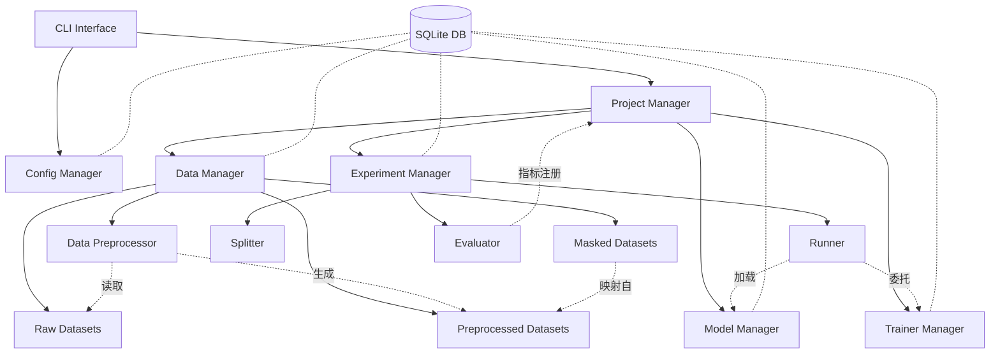

# 总体设计

本文档旨在说明 CLI 工具 UESF（Universal EEG Study Framework）的总体设计。UESF 是一套面向脑电信号深度学习研究的标准化实验管理框架，以命令行工具和 Python 库的双重形态为研究者提供从数据管理、模型注册到实验执行的全生命周期支撑。

> 本文档仅提供架构级的全局视图。各模块的接口定义、数据库表结构、配置文件规范及业务流程等详细设计，请参阅 [设计文档索引](00_index.md) 中列出的对应文档。

## 1. 核心理念

UESF 的核心理念是 **"数据驱动，模型无关"**。它提供了一套标准化的数据管理和实验流程，使得用户可以轻松地在不同的数据集、模型和训练流程之间切换，而无需修改代码。

UESF 的设计遵循以下原则：

- **模块化**: 将数据管理、模型定义、训练流程和实验调度彻底解耦
- **标准化**: 提供标准化的数据格式、组件接口和实验配置规范
- **可扩展**: 支持用户自定义数据集预处理、模型、训练器和评估指标
- **易用性**: 提供层次清晰的 CLI 接口和 YAML 配置文件
- **可追溯**: 通过 JSON 快照和源代码快照，保证每次实验的配置、数据与代码均可追溯复现

### 1.1 核心交互与存储原则

UESF 确立了三个核心原则，统领系统的数据交换与状态留痕机制：

1. **YAML 是与用户的接口**：YAML 仅是系统与用户进行可读交互的形式，UESF 内部的数据流转基于 JSON 对象
2. **JSON 对象快照**：所有输入/输出的 YAML 数据对象，其对应的 JSON 对象均会被持久化存储到数据库中，保证操作行为的可追溯性
3. **源代码快照**：注册全局自定义组件（Trainer/Model）时，系统在数据库中同步存储当前源代码的全文快照，保证底层逻辑已知可溯

> 详见 [核心交互与存储原则](02_core_principles.md)。

## 2. 架构设计

UESF 采用分层架构，以 CLI 为入口，通过各管理器协调数据、模型、训练器与实验的全生命周期。所有元数据统一存储在本地 SQLite 数据库中。

> 目录规范与数据库 Schema 详见 [目录规范](03_storage/01_directory_layout.md) 和 [数据库 Schema 设计](03_storage/02_database_schema.md)。

## 3. 核心组件

### 3.1 Project Manager

Project Manager 负责管理项目。UESF 项目被定义为一套包括数据预处理和一系列实验的工作对象。一个典型的 UESF Project 是一个目录，其中需要包含 `project.yml` 作为配置文件，声明项目使用的数据集、模型、训练器和自定义指标。

Project Manager 不实现过多的验证和限制逻辑，以保证各功能模块可以相对独立地使用，项目仅作为复用配置信息的中心。

组件名称解析遵循三级优先级：**项目级自定义 > 全局自定义 > 内置组件**。

> 详见 [Project Manager 详细设计](04_components/01_project_manager.md)。

### 3.2 Data Manager

Data Manager 负责统一管理所有数据集，包括以下三种类型：

- **Raw Datasets（原始数据集）**：用户需将原始 EEG 数据组织为标准目录格式并附带 `raw.yml` 配置文件。支持"仅注册"（用户自行管理存储）和"导入"（系统集中管理）两种模式。`raw.yml` 需声明 `eeg_data_key`、`label_key`、`dimension_info` 和 `numeric_to_semantic`（数字标签→语义标签映射）等关键字段
- **Preprocessed Datasets（预处理数据集）**：由 Data Preprocessor 从原始数据集处理后产生，以 `.npy` 格式存储。仅能通过预处理流程生成，不能由用户直接导入
- **Masked Datasets（标签映射数据集）**：从现有预处理数据集创建的"虚拟"数据集，仅存储重映射后的标签数组，特征数据不复制。用于极低成本地实现跨数据集标签统一

**Data Preprocessor** 是相对独立的子模块，通过 `preprocess.yml` 定义数据和标签的处理管线，可以脱离项目独立运行。

> 详见 [Data Manager 详细设计](04_components/02_data_manager.md)。

### 3.3 Model Manager

Model Manager 负责管理模型。UESF 支持三类模型：

| 类型 | 标识 | 说明 |
|------|------|------|
| 内置模型 | `EMBEDDED` | UESF 开发者维护的已发表 EEG 深度学习模型 |
| 已注册模型 | `REGISTERED` | 用户自定义模型，首次使用时自动注册到数据库 |
| 全局模型 | `GLOBAL` | 用户导入的系统级共享模型 |

所有自定义模型必须继承 `BaseModel(nn.Module)` 基类，该基类约定了 `__init__`（接收 `n_channels`、`n_samples`、`n_classes` 等由框架自动注入的数据集元数据参数）和 `forward` 等标准接口。

> 详见 [Model Manager 详细设计](04_components/03_model_manager.md)。

### 3.4 Trainer Manager

Trainer Manager 负责管理训练器。训练器定义了模型的训练流程。类似于 Model Manager，UESF 支持三类训练器（`EMBEDDED`、`REGISTERED`、`GLOBAL`）。

所有自定义训练器必须继承 `BaseTrainer` 基类。核心设计：**梯度反向传播与优化器步进由 Trainer 全权负责**（通过 `training_step` 方法），Runner 仅负责数据调度与日志记录。这一"训练委托"设计使得 GAN 交替更新、UDA 多阶段参数冻结等复杂优化策略可以完全闭环隔离在用户代码内部。

> 详见 [Trainer Manager 详细设计](04_components/04_trainer_manager.md)。

### 3.5 Experiment Manager

Experiment Manager 是 UESF 的核心调度枢纽，严格落实**数据流与控制流解耦**的原则，其核心抽象包括：

- **数据集切分器 (Splitter)**：内建 K-Fold、Holdout、Leave-One-Out 等策略，支持基于 `subject`、`record` 等维度的分组隔离，防止数据泄露
- **在线数据变换 (Online Transforms)**：支持基于 Fit-on-Train 原则的运行时数据变换（如全局 Z-Score 标准化），计算统计量完全局限于训练集，并一致性广播到测试集以彻底消除特征统计层面的数据泄露
- **多通道字典映射加载器**：根据实验配置定义的通道名（如 `src_labeled`、`tgt_unlabeled`），平行初始化多组 DataLoader 并打包为字典结构，原生支持域自适应等多数据流场景
- **训练委托 (Delegated Training Step)**：Runner 仅将多通道 `batch` 字典与优化器实例委托给 Trainer
- **评估器 (Evaluator)**：采用"延迟聚合与一次性结算"方案，在 Epoch 结束后对完整预测张量执行统一指标计算，支持自定义指标注册

实验通过 YAML 配置文件定义，涵盖模型/训练器挂载、数据集切分策略、多通道映射、训练超参数、评估指标和日志设置等完整配置。

> 详见 [Experiment Manager 详细设计](04_components/05_experiment_manager.md)。

## 4. 全局配置与数据持久化

- **全局配置**：采用"数据库存储默认值 + `<uesf-home>/config.yml` 文件覆写"的双层机制，当前支持 `data_dir`、`default_device`、`num_workers`、`log_level` 四个配置项
- **SQLite 数据库**：统一存储在 `<uesf-home>/uesf.db`，管理数据集、模型、训练器、评估指标、实验和配置的全部元信息。支持 Schema 版本迁移和事务保护
- **物理存储**：原始数据集（`.mat`）、预处理数据集（`.npy`）和映射标签数组统一存放在可配置的数据目录 `<data-dir>` 下

> 详见 [全局配置机制](03_storage/03_global_config.md) 和 [数据库 Schema 设计](03_storage/02_database_schema.md)。

## 5. CLI 接口概览

UESF 的命令行接口分为四大模块：

| 模块 | 命令前缀 | 功能 |
|------|---------|------|
| 全局配置 | `uesf config` | 查看/设置全局配置参数 |
| 数据管理 | `uesf data` | 原始数据集注册/导入、预处理执行、预处理数据集管理、标签映射 |
| 组件库 | `uesf model` / `uesf trainer` / `uesf metric` | 全局模型/训练器/评估指标的添加、查看、删除 |
| 项目与实验 | `uesf project` / `uesf experiment` | 项目初始化、实验添加/运行/查询/删除 |

> 详见 [CLI 接口参考](06_cli_reference.md)。

## 6. 使用流程

用户使用 UESF 的一般流程如下：

1. **数据准备**：将原始 EEG 数据组织为标准格式，编写 `raw.yml`，通过 `uesf data raw register` 或 `uesf data raw import` 注册/导入数据集
2. **数据预处理**：编写 `preprocess.yml` 定义清洗管线，通过 `uesf data preprocess run` 生成预处理数据集；如需标签重映射，通过 `uesf data preprocessed mask` 创建 Masked Dataset
3. **项目初始化**：通过 `uesf project init` 创建项目目录结构，编写 `project.yml` 声明数据集、模型、训练器和自定义指标
4. **（可选）自定义组件**：编写继承 `BaseModel` / `BaseTrainer` 的自定义模型/训练器，在 `project.yml` 中注册 entrypoint，或通过 `uesf model add` / `uesf trainer add` 导入为全局组件
5. **配置实验**：通过 `uesf experiment add` 创建实验配置文件，指定数据集切分策略、模型/训练器挂载、训练超参数和评估指标
6. **运行实验**：通过 `uesf experiment run --exp <name>` 一键执行训练与评估，系统自动管理检查点存储、日志记录和结果入库
7. **结果查询**：通过 `uesf experiment query` 跨项目检索和对比实验表现

## 7. 技术选型

| 技术 | 用途 |
|------|------|
| Python 3.10+ | 主开发语言，利用类型提示和模式匹配等现代特性 |
| PyTorch 2.5+ | 核心深度学习计算框架 |
| SQLite | 本地轻量级数据库，管理实验配置与元数据 |
| NumPy | 高性能科学计算与 `.npy` 格式数据存储 |
| Typer | 多层级 CLI 构建框架 |
| Rich | 终端排版、进度条与格式化输出 |
| MNE / SciPy | 脑电信号专业预处理（滤波、降噪、频谱分析） |

> 详见 [技术选型](07_tech_stack.md)。