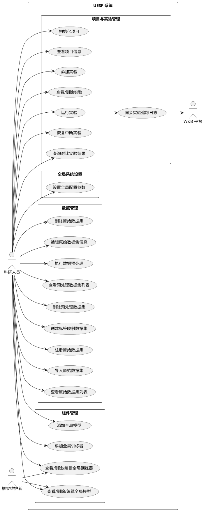
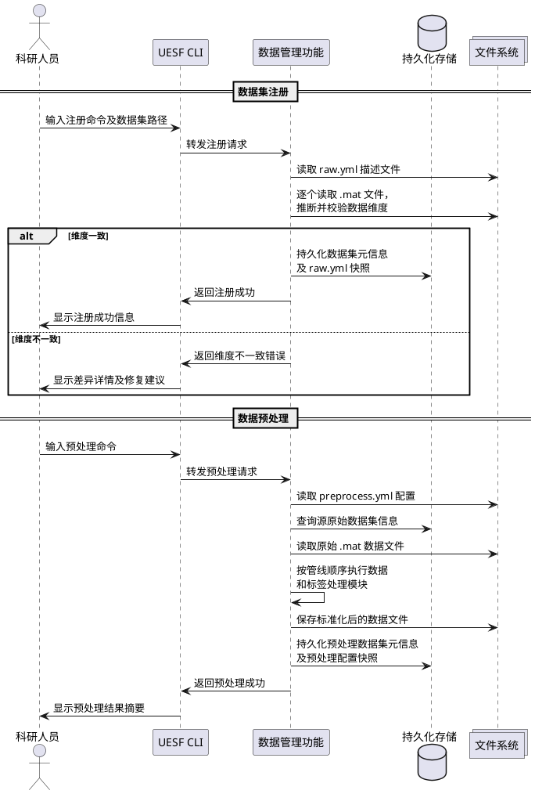
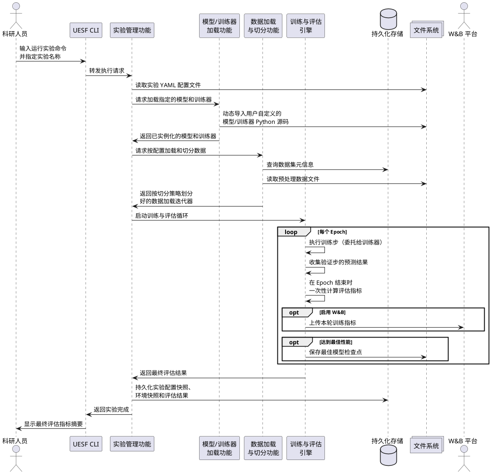

# 《UESF（Universal EEG Study Framework）》项目需求分析文档

## 1 引言

### 1.1 编写目的

本文档旨在对 UESF（Universal EEG Study Framework，通用脑电研究框架）项目进行全面的需求分析。通过对系统目标、用户特点、功能需求、性能需求及运行环境的详细阐述，为后续的系统总体设计、详细设计、编码实现及测试验证提供明确、完整的需求基线。

本文档的预期读者为：项目指导教师、项目开发人员及后续维护人员。

### 1.2 背景

随着脑-机接口（BCI）与情感计算等领域的快速发展，基于脑电图（EEG）信号的深度学习研究日益增多。然而，当前的研究工作普遍面临以下困境：

1. **数据管理碎片化**：不同来源的 EEG 数据集（如 SEED、DEAP 等）在格式、通道数、采样率、标签定义上各不相同。研究者在每次启动新实验前，往往需要编写大量一次性的数据预处理脚本，这些脚本难以复用，且极易因代码管理不善而丢失关键的处理参数。
2. **实验流程不可复现**：深度学习实验涉及数据划分策略、模型架构、超参数配置、训练流程等诸多环节。当这些信息分散在不同的脚本和笔记中时，精确复现一次过往的实验结果将变得极其困难。
3. **模型与训练逻辑的强耦合**：传统的实验脚本将模型定义、损失计算、优化器管理和数据加载混写在一起。当研究者需要尝试新的训练范式（如无监督域自适应 UDA）时，不得不对已有代码进行大范围的侵入式修改。

基于以上背景，本毕业设计提出 UESF 项目。UESF 是一个面向 EEG 深度学习研究的命令行工具（CLI）与 Python 框架，旨在为研究者提供一套标准化、可追溯、可扩展的实验管理解决方案。

- **项目名称**：UESF（Universal EEG Study Framework）
- **项目提出者**：毕业设计学生
- **项目开发者**：毕业设计学生
- **用户**：从事 EEG 深度学习研究的科研人员及研究生

### 1.3 定义

| 术语/缩写 | 定义 |
|---|---|
| UESF | Universal EEG Study Framework，通用脑电研究框架 |
| EEG | Electroencephalogram，脑电图 |
| CLI | Command-Line Interface，命令行接口 |
| BCI | Brain-Computer Interface，脑-机接口 |
| UDA | Unsupervised Domain Adaptation，无监督域自适应 |
| Raw Dataset | 原始数据集，用户按规范组织并注册到 UESF 的原始 `.mat` 格式脑电数据 |
| Preprocessed Dataset | 预处理数据集，由 UESF 数据预处理功能从原始数据集处理生成的标准化数据 |
| Masked Dataset | 标签映射数据集，基于已有预处理数据集通过标签重映射生成的逻辑视图数据集，不产生额外的物理数据拷贝 |
| Trainer | 训练器，定义模型训练流程（包括前向传播、损失计算、梯度更新等）的控制逻辑组件 |
| Model | 模型，定义深度学习网络架构的组件 |
| Project | 项目，UESF 中组织数据集引用、组件注册和实验配置的工作单元 |
| Experiment | 实验，一次完整的模型训练与评估过程，由 YAML 配置文件驱动 |
| K-Fold | K 折交叉验证，将数据集分为 K 份，轮流以其中 1 份作为测试集的验证策略 |
| Holdout | 留出法，将数据集一次性按比例划分为训练/验证/测试集的划分策略 |
| LOOCV | Leave-One-Out Cross-Validation，留一法交叉验证 |
| W&B | Weights & Biases，一种实验追踪与可视化工具 |
| Checkpoint | 模型检查点，训练过程中保存的模型权重快照文件 |
| YAML | YAML Ain't Markup Language，一种人类可读的数据序列化格式，用于系统配置文件 |

### 1.4 参考资料

1. GB/T 8567-2006《计算机软件文档编制规范》
2. PyTorch 官方文档：https://pytorch.org/docs/
3. Typer 官方文档：https://typer.tiangolo.com/
4. MNE-Python 官方文档：https://mne.tools/

---

## 2 需求概述

### 2.1 目标

UESF 的核心目标是构建一个面向 EEG 深度学习研究的"**数据驱动、模型无关**"的统一实验管理框架。具体而言，系统需实现以下目标：

1. **标准化数据管理**：提供对原始 EEG 数据集的注册、导入、预处理的全生命周期管理能力，将异构的原始数据统一转换为高性能的标准化格式，并集中管理所有数据集的元数据信息。
2. **实验的可复现性**：通过 YAML 配置文件驱动实验的全部参数，并持久化存储实验配置、组件源代码和运行环境等关键信息的快照，确保任何一次历史实验都能被精确重建和复现。
3. **模型定义与训练流程的解耦**：系统应提供模型基类和训练器基类的接口规范，将网络架构定义与训练控制逻辑彻底分离。用户无需修改框架代码即可支持从普通分类到复杂 UDA 等多种训练范式。
4. **灵活的可扩展性**：支持用户自定义模型、训练器和评估指标，并通过项目级注册或全局导入两种方式进行管理。系统内置组件与用户自定义组件应遵循统一的接口规范，可以无缝混用。
5. **友好的 CLI 交互体验**：提供层次清晰、功能完整的命令行接口，覆盖数据管理、组件管理、项目管理和实验管理的全部操作，降低非计算机专业研究人员的使用门槛。

### 2.2 用户的特点

UESF 的最终用户主要为以下群体：

| 用户角色 | 教育水平 | 技术专长 | 预期使用频度 |
|---|---|---|---|
| **科研人员/研究生**（主要使用者） | 硕士及以上学历，具备信号处理和机器学习理论基础 | 具备 Python 编程能力，熟悉 PyTorch 框架和深度学习模型的基本构建方式；熟悉命令行基本操作；对数据库、软件工程等计算机专业知识了解有限 | 高频使用（日常科研工作中反复执行数据管理与实验迭代操作） |
| **框架维护者/开发者** | 本科及以上计算机相关专业学历 | 精通 Python、PyTorch，熟悉 CLI 工具开发、数据库设计和软件架构 | 中等频度（进行内置组件的维护、新功能开发和 Bug 修复） |

**关键约束**：由于主要用户为非计算机专业的科研人员，系统的 CLI 帮助信息应清晰友好，配置文件（YAML）的语法应尽量直观简洁，错误提示信息应明确指出问题所在和修复建议。

### 2.3 假定和约束

1. **运行环境假定**：假定用户的运行环境为 Linux 操作系统，且已安装 Python 3.10 及以上版本和 PyTorch 2.5 及以上版本。
2. **数据格式假定**：假定用户提供的原始 EEG 数据已按被试组织为 `.mat` 文件格式，每个 `.mat` 文件中包含脑电数据（EEG Data）和标签（Label）两个字段。
3. **单用户假定**：UESF 为单用户本地工具，不考虑多用户并发访问和权限管理。
4. **存储约束**：大规模 EEG 数据集可能占用大量磁盘空间（数 GB 至数十 GB），用户需确保运行 UESF 的设备具备充足的磁盘存储空间。
5. **GPU 约束**：深度学习模型的训练通常需要 GPU 加速，但 UESF 自身不强制要求 GPU 环境，其数据管理和配置解析功能可在纯 CPU 环境下运行。
6. **开发约束**：系统为毕业设计项目，开发周期有限，将按照敏捷开发原则进行迭代开发，优先实现核心功能。

---

## 3 需求分析

### 3.1 功能的需求分析

#### 3.1.1 系统的使用角色

系统涉及的主要角色及其关系如下：

**角色识别：**

| 角色 | 说明 |
|---|---|
| **科研人员**（Actor，主要使用者） | 系统的最终用户。负责注册/导入数据集、配置预处理流程、编写自定义模型与训练器、配置并执行实验、查询和对比实验结果。 |
| **框架维护者**（Owner/Developer） | 系统的开发者与维护者。负责开发和维护 UESF 内置组件（如内置模型、内置训练器）、内置预处理模块以及 CLI 交互逻辑。 |
| **W&B 平台**（External System） | 外部的实验追踪可视化云平台。当用户启用该功能时，系统需将实验过程中的训练指标数据同步上传至该平台。 |

**用例图：**

#### 3.1.2 用户的业务场景

以下从用户视角识别系统的核心业务场景（用例说明），描述用户与系统之间的典型交互逻辑。

##### 业务场景一：数据集的注册、导入与预处理

**场景描述**：科研人员获得了一批新的 EEG 原始数据，需要将其纳入 UESF 管理，并执行预处理以生成可供模型训练的标准化数据。

**前置条件**：
- 用户已安装 UESF 工具。
- 用户已按 UESF 要求的目录规范组织好原始数据文件（每个被试一个 `.mat` 文件），并编写了包含数据集元信息的 `raw.yml` 配置文件。

**基本事件流**：

| 步骤 | 用户动作 | 系统响应 |
|---|---|---|
| 1 | 执行注册命令，指定原始数据集所在的目录路径 | 系统读取目录下的 `raw.yml` 描述文件，校验各被试 `.mat` 文件的数据维度一致性，自动推断数据和标签的形状信息，将数据集元信息持久化记录，并保存 `raw.yml` 内容的快照 |
| 2 | 执行导入命令，指定需要导入的数据集 | 系统将 `.mat` 数据文件复制到 UESF 管理的专属数据目录下，数据集状态变更为"已导入"，后续由 UESF 集中管理保管 |
| 3 | 编写预处理配置文件 `preprocess.yml`，定义数据和标签的处理管线 | — |
| 4 | 执行预处理命令 | 系统加载预处理配置，按照管线中定义的处理模块依次对数据和标签进行处理（如滤波、分段、标签映射等），将处理后的标准化数据保存到输出目录，并将预处理数据集的元信息和本次使用的配置快照一并持久化记录 |

**替代事件流**：
- 步骤 1 中，若各被试 `.mat` 文件的数据维度不一致，系统应终止操作并报告差异详情。
- 步骤 4 中，若未找到可用的预处理配置文件或无法确定输入数据集，系统应终止并提示用户明确指定。

**用例协作图（数据集注册与预处理流程）：**

##### 业务场景二：自定义模型与训练器的开发与注册

**场景描述**：科研人员需要在 UESF 中使用自己设计的深度学习模型和训练流程。

**前置条件**：
- 用户已初始化一个 UESF 项目。
- 用户了解 UESF 要求的模型基类和训练器基类的接口规范。

**基本事件流**：

| 步骤 | 用户动作 | 系统响应 |
|---|---|---|
| 1 | 编写继承模型基类的自定义模型类 Python 源码 | — |
| 2 | 在项目配置文件中注册自定义模型的入口（源文件路径和类名） | — |
| 3 | 编写继承训练器基类的自定义训练器类 Python 源码 | — |
| 4 | 在项目配置文件中注册自定义训练器的入口 | — |
| 5 | （可选）执行全局模型导入命令 | 系统拷贝源代码文件到 UESF 的全局组件目录下，并持久化记录组件元信息和**源代码全文快照**，使该模型成为跨项目可复用的全局组件 |

##### 业务场景三：实验配置、执行与结果查询

**场景描述**：科研人员需要配置一个深度学习实验，执行训练与评估，并查询对比不同实验的结果。

**前置条件**：
- 用户已完成数据集的预处理（或已有可用的预处理数据集）。
- 用户已注册好要使用的模型和训练器。
- 用户已初始化 UESF 项目。

**基本事件流**：

| 步骤 | 用户动作 | 系统响应 |
|---|---|---|
| 1 | 执行添加实验命令 | 系统在项目目录下生成空白实验配置模板，或复制指定旧实验的配置以便做修改 |
| 2 | 编辑实验配置 YAML 文件，指定模型、训练器、数据集、切分策略、训练超参数、评估指标等 | — |
| 3 | 执行运行实验命令，指定实验名称 | 系统解析实验配置，加载并实例化模型和训练器，根据切分策略划分数据集，执行训练与评估循环，自动保存最佳模型权重检查点。实验完成后，系统持久化记录完整的实验配置快照、运行环境快照和各项评估指标结果 |
| 4 | 执行查询实验命令，指定关注的评估指标 | 系统检索已完成实验的结果，按用户指定的指标进行对比排列并在终端展示 |

**替代事件流**：
- 步骤 3 中，若实验训练过程中发生 GPU 内存溢出（OOM）或系统崩溃导致中断，用户可通过恢复命令从最近的检查点恢复训练进度，实现续训。

**用例协作图（实验执行流程）：**

##### 业务场景四：标签映射数据集的创建与使用

**场景描述**：科研人员需要在不产生额外数据拷贝的前提下，将一个细粒度分类的数据集（如四分类情绪）降维为粗粒度分类（如二分类：积极/消极），以便在不同实验间灵活复用。

**前置条件**：
- 系统中已存在目标预处理数据集。

**基本事件流**：

| 步骤 | 用户动作 | 系统响应 |
|---|---|---|
| 1 | 编写标签映射规则文件，定义旧标签到新标签的映射关系（如 `angry → negative`） | — |
| 2 | 执行创建标签映射数据集命令，指定源数据集名、输出名和映射规则文件 | 系统持久化记录映射关系和新数据集名称，关联到源预处理数据集。**不复制任何物理数据文件** |
| 3 | 在实验配置中直接使用新名称引用该数据集 | 系统在运行实验时，正常读取底层源预处理数据集的特征数据文件，同时根据映射规则动态替换标签值。对用户而言，该数据集与普通预处理数据集的使用方式完全一致 |

### 3.3 性能需求分析

1. **数据加载性能**：预处理后的数据应采用高性能的二进制格式存储，确保模型训练时数据供给速率不成为性能限制因素，消除大规模数据集加载时的 I/O 瓶颈。
2. **元信息查询性能**：系统对高频检索的数据（如实验结果、数据集信息等）应建立高效的索引或检索机制，确保在实验数量增长到数百条量级时，查询与结果对比操作仍能在秒级内响应。
3. **Masked Dataset 零存储开销**：标签映射数据集不应复制底层预处理数据集的特征数据文件，应仅在运行时通过动态标签映射实现逻辑复用，创建 Masked Dataset 的额外存储占用应可忽略不计。

### 3.4 输入输出要求

#### 3.4.1 输入数据

| 输入项 | 媒体/格式 | 说明 |
|---|---|---|
| **原始 EEG 数据** | `.mat` 文件（MATLAB 格式） | 每个文件对应一个被试，包含 EEG 数据数组和标签数组两个字段。键名由描述文件指定。数据数组为浮点型多维数组，维度含义（如 `[record, channel, sample]`）由用户在描述文件中指明 |
| **原始数据集描述文件** | `raw.yml`（YAML 格式） | 包含数据集名称、描述、采样率、被试数、通道数、采样点数、电极列表、维度信息、标签映射（数字标签到语义标签的对应关系）等元信息 |
| **预处理配置文件** | `preprocess.yml`（YAML 格式） | 定义数据和标签的预处理管线（pipeline），包括处理模块名称及其参数、源数据集名称、输出数据集名称等 |
| **项目配置文件** | `project.yml`（YAML 格式） | 定义项目名称、描述、引用的数据集列表、已注册的模型/训练器/指标的入口信息等 |
| **实验配置文件** | `<experiment_name>.yml`（YAML 格式） | 定义实验的完整参数：模型名称及参数、训练器名称及参数、数据集别名与切分策略（如 K-Fold、Holdout）、训练超参数（epochs、batch_size、learning_rate、optimizer、scheduler、early_stopping 等）、评估指标列表和日志配置 |
| **标签映射规则文件** | YAML 格式 | 定义旧语义标签到新语义标签的映射关系字典（如 `{"angry": "negative", "happy": "positive"}`） |
| **自定义模型源码** | `.py` 文件（Python 源码） | 需继承系统规定的模型基类，实现网络结构定义和前向传播方法 |
| **自定义训练器源码** | `.py` 文件（Python 源码） | 需继承系统规定的训练器基类，实现训练步和验证步逻辑 |
| **自定义指标函数** | `.py` 文件（Python 源码） | 需遵循系统约定的统一函数签名，接收预测结果和真实标签，返回标量数值或可序列化的指标字典 |
| **全局配置文件** | `~/.uesf/config.yml`（YAML 格式，可选） | 用户可通过此文件覆写系统的全局默认参数（如数据存储目录路径） |
| **CLI 命令参数** | 命令行字符串 | 命令行直接提供的参数优先级高于 YAML 配置文件中的相应设定 |

#### 3.4.2 输出数据

| 输出项 | 媒体/格式 | 说明 |
|---|---|---|
| **预处理后 EEG 数据** | 高性能二进制格式文件 | 标准化后的多维浮点型数组，维度含义（如 `[subject, record, channel, sample]`）由元信息记录 |
| **预处理后标签数据** | 高性能二进制格式文件 | 与预处理后 EEG 数据对应的标签数组 |
| **模型检查点文件** | `.pt` / `.pth` 文件（PyTorch 序列化格式） | 训练过程中依据监控指标（如验证集 F1 分数）自动保存的最优模型权重文件 |
| **实验结果文件** | YAML 格式 | 包含本次实验各项评估指标的计算结果（如准确率、F1 分数、混淆矩阵等） |
| **CLI 终端输出** | 格式化终端文本 | 包括：数据集列表表格、实验结果对比表格、训练进度条、日志消息（含警告提示）、错误信息及修复建议 |
| **持久化元信息记录** | 系统内部存储 | 包括：数据集元信息、组件注册信息、实验配置快照、评估结果、运行环境快照、源代码快照等 |
| **W&B 追踪日志**（可选） | W&B 平台数据（HTTPS 传输） | 当用户启用实验追踪功能时，训练过程中的 Loss 收敛趋势和动态指标曲线将同步上传至 W&B 云平台 |

### 3.5 故障处理要求

1. **训练中断恢复**：当实验训练过程中遭遇 GPU 内存溢出（OOM）或系统崩溃等异常时，系统应记录中断时的状态，并保留最近的 Checkpoint 权重文件和环境快照。用户应能通过恢复命令从中断点继续训练，系统需还原数据加载进度和优化器状态，实现无损恢复续训。
2. **数据一致性校验失败**：在原始数据集注册/导入时，若系统检测到各被试 `.mat` 文件的数据维度不一致，系统应终止操作并向用户详细报告不一致的差异信息，避免将有缺陷的数据引入后续流程。
3. **配置文件解析错误**：当 YAML 配置文件格式非法、缺少必填字段或字段值不合法时，系统应提供明确的错误提示信息，指出问题发生的文件位置和具体字段，并给出修复建议。
4. **组件加载失败**：当用户指定的自定义模型或训练器源代码文件不存在、类名不匹配或不满足基类接口规范时，系统应终止实验并输出详细的错误诊断信息。
5. **名称冲突警告**：当项目级自定义组件名与全局或内置组件名冲突时，系统应在日志中输出警告信息提示用户存在名称遮蔽，但不阻止执行。

### 3.6 其他专门要求

1. **可追溯性要求**：系统应确保所有关键操作的完整可追溯——所有用户提交的配置信息应被持久化快照存储；所有注册的自定义组件源代码应在注册时存储全文快照。此机制确保用户可以在任意时刻回溯历史操作的完整上下文。
2. **可扩展性要求**：模型、训练器和评估指标均应通过基类继承或函数签名约束实现插件化扩展机制，新增组件不应需要修改框架源代码。
3. **易用性要求**：系统应自动生成清晰的 CLI 帮助文档，在终端中提供美观的表格、进度条和格式化输出，降低用户的学习和使用成本。
4. **可维护性要求**：代码应采用模块化分层架构，各功能模块之间应保持低耦合，便于后续功能扩展和 Bug 排查。

---

## 4 运行环境规定

### 4.1 设备

| 分类 | 规格要求 |
|---|---|
| **处理器** | x86_64 架构处理器，推荐 Intel Core i5 / AMD Ryzen 5 及以上。用于数据预处理和 CLI 操作 |
| **内存** | 最低 8 GB RAM，推荐 16 GB 及以上。大规模 EEG 数据集的预处理和模型训练需要较大的内存空间 |
| **GPU（可选）** | 支持 CUDA 的 NVIDIA GPU（显存 ≥ 4 GB），推荐 8 GB 及以上。深度学习模型训练时需要 GPU 加速，但 UESF 的数据管理和配置功能不依赖 GPU |
| **磁盘存储** | 推荐 SSD 固态硬盘，可用空间 ≥ 50 GB。EEG 原始数据和预处理数据可能占用大量存储空间 |
| **输入设备** | 标准键盘（CLI 命令输入） |
| **输出设备** | 终端显示器（CLI 文本输出），支持 Unicode 和 ANSI 色彩显示 |
| **网络设备** | （可选）网络连接，用于 W&B 日志同步上传和 pip 依赖安装 |

### 4.2 支持软件

| 分类 | 软件 | 版本要求 | 说明 |
|---|---|---|---|
| **操作系统** | Linux 发行版 | Ubuntu 20.04 及以上或其他主流 Linux 发行版 | UESF 面向 Linux 环境运行 |
| **运行时环境** | Python | 3.10+ | 利用现代类型提示和模式匹配等语言特性 |
| **深度学习框架** | PyTorch | 2.5+ | 提供动态计算图和 GPU 加速支持 |
| **科学计算** | NumPy | 最新稳定版 | 高性能数组计算与数据存取 |
| **信号处理** | MNE-Python 和/或 SciPy | 最新稳定版 | 专业的脑电信号预处理（滤波、降噪、频谱分析等） |
| **实验追踪（可选）** | Weights & Biases (wandb) | 最新稳定版 | 训练过程的可视化追踪与云端同步 |

### 4.3 接口

UESF 作为一个 CLI 工具与 Python 框架，对外主要暴露以下与其他软件或外部系统之间的接口：

| 接口 | 协议/方式 | 说明 |
|---|---|---|
| **CLI 命令行接口** | 标准输入/输出（stdin / stdout / stderr） | UESF 对外的主要交互接口。用户通过在终端输入 `uesf` 开头的命令进行操作，系统通过标准输出和标准错误流返回执行结果和提示信息。命令行参数遵循 POSIX 风格 |
| **Python 库接口** | Python `import` 机制 | UESF 可作为 Python 包被第三方脚本导入使用。对外暴露模型基类（`BaseModel`）、训练器基类（`BaseTrainer`）和评估指标函数签名规范，用户通过继承基类或实现函数签名来扩展自定义组件 |
| **W&B 平台接口** | HTTPS（通过 `wandb` Python SDK） | 当用户启用实验追踪功能时，UESF 通过第三方 `wandb` SDK 与 Weights & Biases 云平台进行通信，上传训练过程中的 Loss 曲线、指标趋势等实验追踪数据 |
| **MATLAB 数据文件接口** | `.mat` 文件格式（HDF5 / MATLAB v5） | UESF 需读取外部工具（如 MATLAB、EEGLAB 等）产生的 `.mat` 格式脑电数据文件。系统通过 `scipy.io.loadmat` 或 `h5py` 等库解析该格式 |
| **PyTorch 模型序列化接口** | `.pt` / `.pth` 文件格式（PyTorch `torch.save`） | UESF 生成的模型检查点文件遵循 PyTorch 标准序列化格式，可被任何 PyTorch 程序直接加载使用 |
