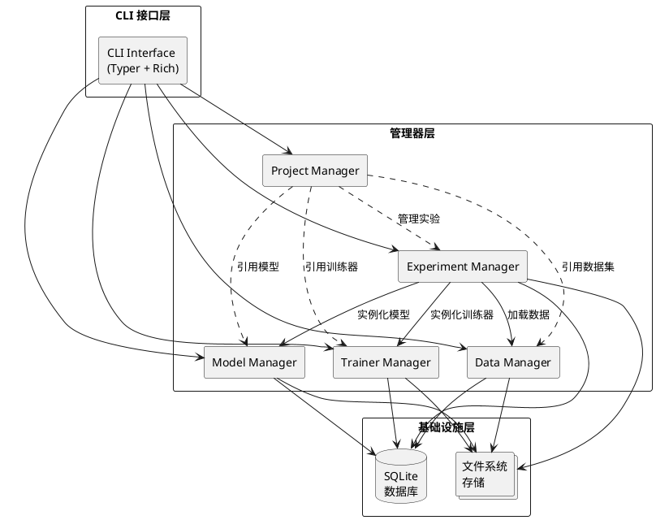
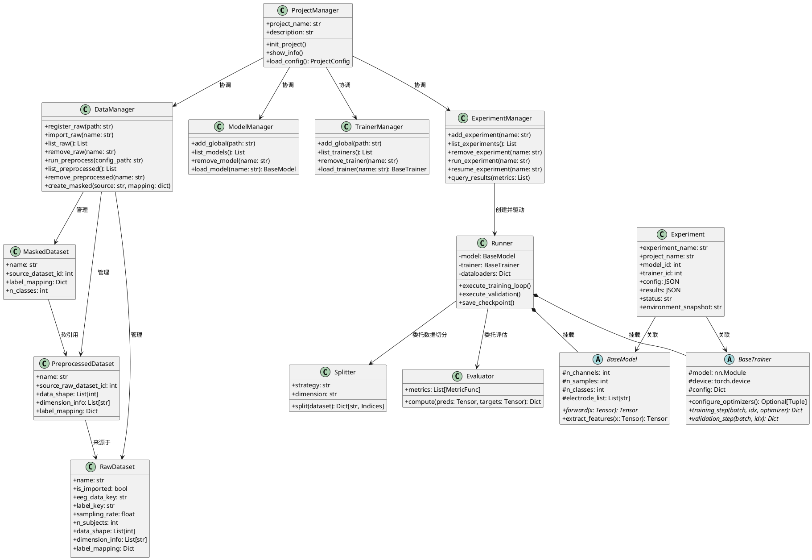
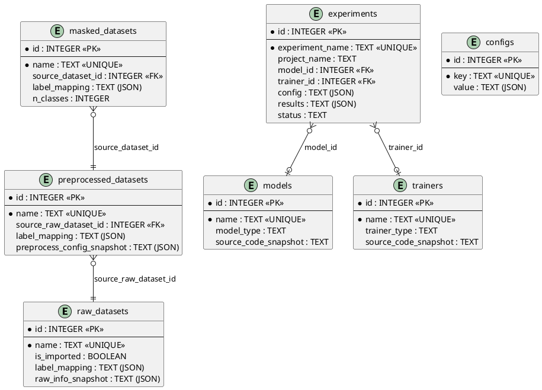
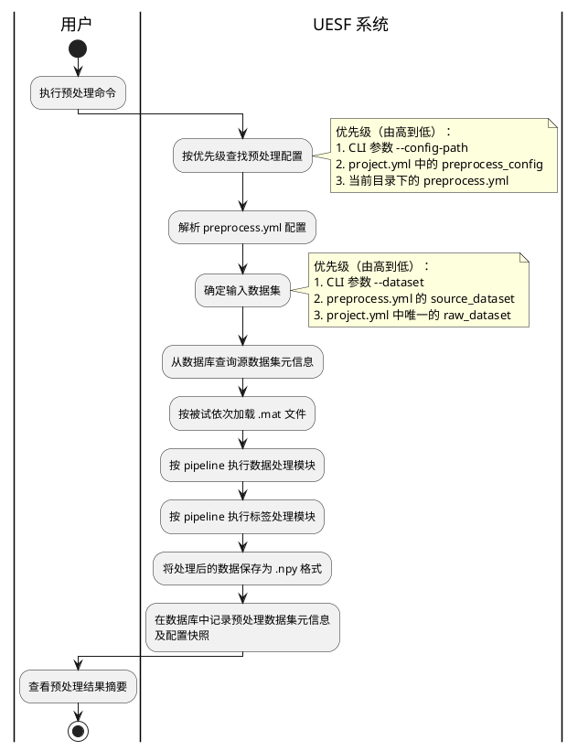
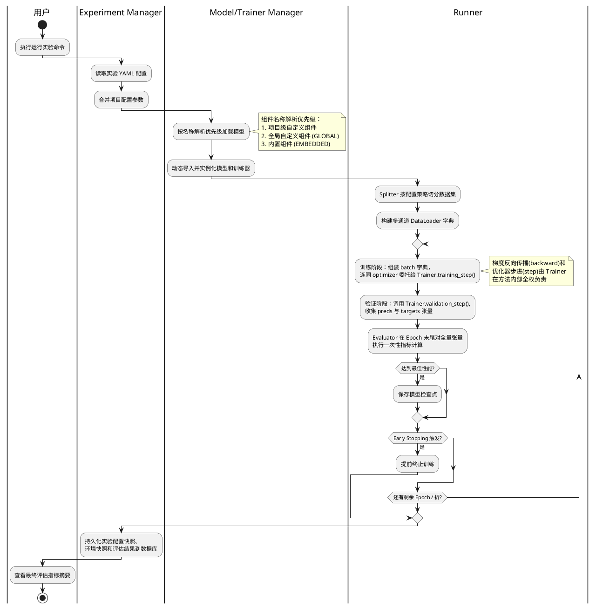

# 《UESF（Universal EEG Study Framework）》项目的概要设计说明书

## 1 引言

### 1.1 编写目的

本文档是 UESF（Universal EEG Study Framework，通用脑电研究框架）项目的概要设计说明书。本文档基于已通过评审的《UESF 项目需求分析文档》，对系统的总体架构、模块划分、核心类模型、界面设计、数据存储方案及关键运行流程进行概要级别的阐述，为后续的详细设计、编码实现和系统测试提供技术蓝图。

本文档的预期读者为：项目指导教师、项目开发人员及后续维护人员。

### 1.2 背景

UESF 是一个面向 EEG 深度学习研究的命令行工具（CLI）与 Python 框架，旨在解决当前 EEG 研究领域中数据管理碎片化、实验流程不可复现以及模型与训练逻辑强耦合等核心问题。系统以"**数据驱动、模型无关**"为核心理念，通过提供标准化的数据管理、可追溯的实验配置驱动和高度解耦的组件化架构，为研究者构建一套完整的实验管理解决方案。

- **项目名称**：UESF（Universal EEG Study Framework）
- **项目提出者/开发者**：毕业设计学生
- **目标用户**：从事 EEG 深度学习研究的科研人员及研究生

### 1.3 定义

| 术语/缩写 | 定义 |
|---|---|
| UESF | Universal EEG Study Framework，通用脑电研究框架 |
| EEG | Electroencephalogram，脑电图 |
| CLI | Command-Line Interface，命令行接口 |
| BCI | Brain-Computer Interface，脑-机接口 |
| UDA | Unsupervised Domain Adaptation，无监督域自适应 |
| Raw Dataset | 原始数据集，用户按规范组织并注册到 UESF 的原始 `.mat` 格式脑电数据 |
| Preprocessed Dataset | 预处理数据集，由 UESF 数据预处理功能从原始数据集处理生成的标准化 `.npy` 格式数据 |
| Masked Dataset | 标签映射数据集，基于已有预处理数据集通过标签重映射生成的逻辑视图数据集，不产生额外的物理数据拷贝 |
| Trainer | 训练器，定义模型训练流程（包括前向传播、损失计算、梯度更新等）的控制逻辑组件 |
| Model | 模型，定义深度学习网络架构的组件 |
| Project | 项目，UESF 中组织数据集引用、组件注册和实验配置的工作单元 |
| Experiment | 实验，一次完整的模型训练与评估过程，由 YAML 配置文件驱动 |
| Runner | 执行器，UESF 中负责将配置解析为执行流、驱动训练与评估循环的核心引擎 |
| Evaluator | 评估器，UESF 中负责调用指标函数并汇总计算评估结果的组件 |
| JSON 快照 | 系统将用户输入的 YAML 转化为 JSON 对象后存储到数据库中的副本，用于操作行为的可追溯性保证 |
| SQLite | 一种轻量级的嵌入式关系型数据库管理系统 |

### 1.4 参考资料

1. 《UESF 项目需求分析文档》
2. 《UESF 总体设计文档（01_overall_design.md）》
3. 《UESF 详细设计文档（02_design_details.md）》
4. GB/T 8567-2006《计算机软件文档编制规范》
5. PyTorch 官方文档：https://pytorch.org/docs/
6. Typer 官方文档：https://typer.tiangolo.com/
7. MNE-Python 官方文档：https://mne.tools/

---

## 2 总体设计

### 2.1 设计概述

UESF 采用**分层模块化架构**进行系统设计，遵循"数据驱动、模型无关"的核心理念。系统设计遵循以下核心原则：

1. **模块化**：将数据管理、模型定义、训练控制和实验流程四大关注点解耦为独立的系统元素。
2. **标准化**：通过统一的 YAML 配置规范和数据格式约定，实现实验流程的高度标准化。
3. **可扩展**：提供基类继承与函数签名约束两种插件化扩展机制，支持用户自定义模型、训练器和评估指标。
4. **可追溯**：所有用户提交的配置信息和自定义组件源代码在入库时均进行 JSON/全文快照存储，确保完整的操作回溯能力。

系统的体系架构采用以下方法论：

- **YAML 是与用户的接口**：所有用户交互层面的配置均通过人类可读的 YAML 格式进行。系统内部的数据流转基于 JSON 对象，读取用户 YAML 后即刻转化为 JSON 对象进行业务处理。
- **JSON 对象快照**：所有输入输出 UESF 的 YAML 数据对象，其 JSON 格式均保存到数据库中，保证操作行为和配置的可追溯性。
- **源代码快照**：用户注册的自定义 Trainer 或 Model 等源码类组件，系统在触发添加操作时向数据库中存储该源代码的全文快照，确保跨项目的绝对可重复性。
- **数据流与控制流解耦**：网络架构定义（Model）与训练控制逻辑（Trainer）通过基类接口规范彻底分离，实验配置解析和运行调度由框架 Runner 统一驱动。

### 2.2 运行环境

#### 硬件环境

| 分类 | 规格要求 |
|---|---|
| **处理器** | x86_64 架构处理器，推荐 Intel Core i5 / AMD Ryzen 5 及以上 |
| **内存** | 最低 8 GB RAM，推荐 16 GB 及以上 |
| **GPU**（可选） | 支持 CUDA 的 NVIDIA GPU（显存 ≥ 4 GB），推荐 8 GB 及以上。数据管理和配置功能不依赖 GPU |
| **磁盘存储** | 推荐 SSD 固态硬盘，可用空间 ≥ 50 GB |

#### 支持软件环境

| 分类 | 软件 | 版本要求 | 说明 |
|---|---|---|---|
| **操作系统** | Linux 发行版 | Ubuntu 20.04+ | UESF 面向 Linux 环境运行 |
| **运行时环境** | Python | 3.10+ | 利用类型提示和模式匹配等现代语言特性 |
| **深度学习框架** | PyTorch | 2.5+ | 动态计算图和 GPU 加速支持 |
| **本地数据库** | SQLite | Python 内置 | 轻量级嵌入式关系型数据库，无需额外安装 |
| **科学计算** | NumPy | 最新稳定版 | 高性能数组计算与 `.npy` 格式数据存取 |
| **信号处理** | MNE-Python / SciPy | 最新稳定版 | 脑电信号的滤波、降噪、频谱分析等预处理 |
| **CLI 框架** | Typer | 最新稳定版 | 多层级命令行接口构建 |
| **终端 UI** | Rich | 最新稳定版 | 进度条、表格、格式化日志输出 |
| **实验追踪**（可选） | Weights & Biases | 最新稳定版 | 训练过程的可视化追踪与云端同步 |

### 2.3 系统的结构设计

#### 2.3.1 顶层架构

UESF 系统采用分层架构，由 CLI 接口层、管理器层和基础设施层三个层次组成。顶层结构如下图所示：



#### 2.3.2 系统元素一览

| 系统元素标识符 | 功能描述 | 所属层次 |
|---|---|---|
| **CLI Interface** | 系统对外的命令行交互入口，基于 Typer 框架构建，通过 Rich 提供美观的终端输出。将用户命令解析后分发给管理器层的各对应模块 | CLI 接口层 |
| **Project Manager** | 管理 UESF 项目的生命周期。负责解析 `project.yml` 配置文件，协调数据集引用、组件注册和实验配置，提供项目初始化、信息查看等功能 | 管理器层 |
| **Data Manager** | 统一管理所有 EEG 数据集，包含三个子模块：**Raw Dataset Manager**（管理原始数据集的注册、导入、查看、删除等操作）、**Data Preprocessor**（执行数据预处理流水线，可独立于项目运行）和 **Preprocessed Dataset Manager**（管理预处理后数据集及 Masked Dataset 的查询和删除操作） | 管理器层 |
| **Model Manager** | 管理深度学习模型，支持三类模型：内置模型（EMBEDDED）、项目级自定义模型（REGISTERED）和全局自定义模型（GLOBAL）。提供模型的注册、导入、查看、删除等操作 | 管理器层 |
| **Trainer Manager** | 管理训练器组件，与 Model Manager 结构对称，同样支持内置、项目级和全局三种类型。提供训练器的注册、导入、查看、删除等操作 | 管理器层 |
| **Experiment Manager** | 系统的核心调度枢纽。负责将静态的实验 YAML 配置解析为可执行流，协调 Runner（执行器）、Splitter（数据集切分器）、Multi-channel Dataloader（多通道数据加载器）和 Evaluator（评估器）等子组件完成实验的全流程运行 | 管理器层 |
| **SQLite 数据库** | 本地嵌入式关系型数据库，统一存储所有数据集元信息、组件注册信息、实验配置快照、实验结果、全局配置及各类 JSON/源代码快照 | 基础设施层 |
| **文件系统存储** | 管理所有物理文件的存储，包括原始数据集 `.mat` 文件、预处理数据集 `.npy` 文件、全局组件 `.py` 源代码文件和实验检查点 `.pth` 权重文件 | 基础设施层 |

#### 2.3.3 元素间交互关系

各系统元素之间的核心交互关系如下：

1. **CLI Interface → 各 Manager**：CLI 接口层接收用户命令后，根据命令类别将请求分发给对应的 Manager 进行业务处理。
2. **Project Manager ↔ Data/Model/Trainer Manager**：Project Manager 解析 `project.yml` 后，引用并校验 Data Manager、Model Manager 和 Trainer Manager 中已注册的相关组件。
3. **Experiment Manager → Data/Model/Trainer Manager**：实验执行时，Experiment Manager 根据实验配置，从 Data Manager 获取数据集并构造数据加载器，从 Model Manager 和 Trainer Manager 分别动态加载并实例化模型和训练器。
4. **各 Manager → SQLite 数据库 / 文件系统**：所有 Manager 均通过数据库进行元信息的持久化存储与查询，通过文件系统进行数据文件和源代码文件的读写操作。


### 2.4 问题域类模型

以下类图展示 UESF 系统中问题域核心对象及其关系：



**各核心类功能描述：**

| 类名 | 功能描述 |
|---|---|
| **ProjectManager** | 管理项目配置的解析与加载，协调各子管理器的调用，提供项目初始化和信息展示功能 |
| **DataManager** | 统一管理原始数据集、预处理数据集和标签映射数据集的全部生命周期操作 |
| **ModelManager** | 管理模型的注册、全局导入和动态加载，支持按类型（EMBEDDED / REGISTERED / GLOBAL）分级管理 |
| **TrainerManager** | 管理训练器的注册、全局导入和动态加载，结构与 ModelManager 对称 |
| **ExperimentManager** | 系统核心调度。负责实验的添加、查询、删除以及通过 Runner 驱动实验的完整执行流程 |
| **Runner** | 实验执行器，极度瘦身的控制流驱动。负责调度数据切分、多通道数据加载、训练循环和评估结算。不维护任何特定算法的 Loss 计算逻辑，将训练步的完整优化控制权委托给 Trainer |
| **Evaluator** | 评估计算组件。在每个 Epoch 结束时，对全量预测与标签张量执行一次性指标计算，避免批次级平均导致的统计失真 |
| **Splitter** | 数据集切分器。支持 Holdout、K-Fold、Leave-One-Out 等切分策略，并可按 subject、record 等维度进行分组隔离 |
| **BaseModel** | 模型抽象基类（`nn.Module` 子类）。规定模型必须接收 `n_channels`、`n_samples`、`n_classes` 等维度参数并实现 `forward()` 接口 |
| **BaseTrainer** | 训练器抽象基类。规定训练器必须实现 `training_step()` 和 `validation_step()` 接口，在 `training_step` 中全权负责梯度反向传播和优化器步进 |
| **RawDataset** | 原始数据集实体。记录 `.mat` 格式数据的元信息，包括数据键名、维度信息和标签映射 |
| **PreprocessedDataset** | 预处理数据集实体。记录预处理后 `.npy` 数据的元信息，维护与源原始数据集的外键引用关系 |
| **MaskedDataset** | 标签映射数据集实体。通过软引用挂载到源预处理数据集，在运行时动态拦截并替换标签值，实现零存储开销的标签重映射 |
| **Experiment** | 实验记录实体。以 JSON 字符串形式存储完整的实验配置和评估结果，关联使用的模型和训练器，支持跨项目检索 |

**核心类间关系说明：**

- **ProjectManager** 作为顶层协调者，引用并组织 DataManager、ModelManager、TrainerManager 和 ExperimentManager 的功能。
- **ExperimentManager** 在执行实验时，创建 **Runner** 实例。Runner 内部挂载 **BaseModel** 和 **BaseTrainer** 的具体实现，并委托 **Splitter** 进行数据切分、**Evaluator** 进行指标计算。
- **DataManager** 管理三种数据集实体，其中 **PreprocessedDataset** 通过外键引用 **RawDataset**，**MaskedDataset** 通过外键软引用 **PreprocessedDataset**。
- **Experiment** 实体通过外键关联其使用的 Model 和 Trainer 记录，支持按特定模型或训练器检索其在所有实验中的历史表现。


### 2.5 系统的界面设计

UESF 是一个命令行工具（CLI），其用户界面完全在终端中运行。系统通过 Typer 框架构建层次化的命令结构，通过 Rich 库提供美观的终端 UI（如表格、进度条、语法高亮等），所有交互通过标准输入/输出进行。

#### 2.5.1 CLI 命令层次结构

系统的命令行界面按如下层次组织为四大命令组：

```text
uesf
├── set <KEY> <VALUE>                        # 全局系统设置
├── data                                     # 数据管理命令组
│   ├── raw                                  # 原始数据集管理
│   │   ├── register <path>                  #   注册原始数据集
│   │   ├── import <path>                    #   导入原始数据集
│   │   ├── list                             #   查看原始数据集列表
│   │   ├── remove <name>                    #   删除原始数据集
│   │   └── edit <name>                      #   编辑数据集信息
│   ├── preprocess                           # 数据预处理
│   │   └── run [--config-path] [--dataset] [--out-name]
│   └── preprocessed                         # 预处理数据集管理
│       ├── list                             #   查看预处理数据集列表
│       ├── remove <name>                    #   删除预处理数据集
│       └── mask <source> [--out-name] [--mapping-file]  # 创建标签映射数据集
├── model                                    # 模型管理命令组
│   ├── add <path>                           #   添加全局模型
│   ├── list                                 #   查看模型列表
│   ├── remove <name>                        #   删除模型
│   └── edit <name>                          #   编辑模型信息
├── trainer                                  # 训练器管理命令组
│   ├── add <path>                           #   添加全局训练器
│   ├── list                                 #   查看训练器列表
│   ├── remove <name>                        #   删除训练器
│   └── edit <name>                          #   编辑训练器信息
├── project                                  # 项目管理命令组
│   ├── init                                 #   初始化项目
│   └── info                                 #   查看项目信息
└── experiment                               # 实验管理命令组
    ├── add [--from <name>]                  #   添加实验
    ├── list                                 #   查看实验列表
    ├── remove <name> [--results-only]       #   删除实验
    ├── run --exp <name>                     #   运行实验
    ├── resume --exp <name>                  #   断点续训
    └── query [--metrics ...]                #   查询实验结果
```

#### 2.5.2 核心界面交互说明

**（1）数据集列表界面**

用户执行 `uesf data raw list` 或 `uesf data preprocessed list` 后，系统通过 Rich 在终端渲染数据集信息表格，展示的字段包括数据集名称、状态（已注册/已导入）、被试数、采样率、通道数、采样点数、类别数和创建时间等。

输入：`uesf data raw list`
输出：以 Rich Table 形式展示的数据集列表。

**（2）预处理执行界面**

用户执行 `uesf data preprocess run` 后，系统在终端显示预处理管线的进度条和各处理步骤的日志输出。完成后显示预处理结果摘要（输出数据形状、标签分布等）。

输入：`uesf data preprocess run --config-path ./preprocess.yml --dataset my_dataset`
输出：Rich 进度条 + 处理日志 + 结果摘要表格。

**（3）实验运行界面**

用户执行 `uesf experiment run --exp <name>` 后，系统在终端显示训练进程信息，包括当前 Epoch/总 Epoch 数、训练损失、验证集指标、学习率等实时信息。若启用 W&B，则同步上传至 W&B 平台。

输入：`uesf experiment run --exp exp_001`
输出：训练进度条 + 每 Epoch 指标日志 + 最终结果摘要。

**（4）实验结果查询界面**

用户执行 `uesf experiment query --metrics accuracy f1_score` 后，系统从数据库检索已完成实验的结果，以对比表格的形式在终端展示。

输入：`uesf experiment query --metrics accuracy f1_score`
输出：以 Rich Table 形式展示的跨实验指标对比表。

#### 2.5.3 页面跳转关系

UESF 作为 CLI 工具，不存在传统意义上的"页面跳转"。用户在终端中通过输入不同的命令切换功能场景，系统对每条命令独立执行并输出结果。所有命令均支持 `--help` 参数查看帮助文档。

命令间的逻辑关联为：

```text
uesf data raw register → uesf data raw import → uesf data preprocess run → uesf data preprocessed list
                                                                         ↓
                                                              uesf data preprocessed mask
                                                                         ↓
uesf project init → uesf experiment add → uesf experiment run → uesf experiment query
```

#### 2.5.4 界面类设计

UESF 的 CLI 界面通过 Typer + Rich 实现，主要涉及以下界面相关类：

| 类/模块 | 功能描述 |
|---|---|
| **cli.main** | Typer 应用入口，定义顶层命令组（`data`、`model`、`trainer`、`project`、`experiment`）的路由注册 |
| **cli.data_commands** | 数据管理相关命令的实现模块，处理 `uesf data` 下的所有子命令并调用 DataManager |
| **cli.model_commands** | 模型管理相关命令的实现模块，处理 `uesf model` 下的所有子命令并调用 ModelManager |
| **cli.trainer_commands** | 训练器管理相关命令的实现模块，处理 `uesf trainer` 下的所有子命令并调用 TrainerManager |
| **cli.project_commands** | 项目管理相关命令的实现模块，处理 `uesf project` 下的所有子命令并调用 ProjectManager |
| **cli.experiment_commands** | 实验管理相关命令的实现模块，处理 `uesf experiment` 下的所有子命令并调用 ExperimentManager |
| **ui.table_renderer** | 基于 Rich 的表格渲染工具，用于格式化展示数据集列表、实验结果等结构化信息 |
| **ui.progress_renderer** | 基于 Rich 的进度条渲染工具，用于展示预处理和训练过程的实时进度 |


### 2.6 数据存储设计

UESF 采用 **SQLite 数据库 + 文件系统** 的混合存储方案。SQLite 存储所有元信息、配置快照和实验结果等结构化数据；文件系统存储原始数据文件、预处理后的二进制数组数据、模型源代码和检查点权重等大型二进制文件。

#### 2.6.1 数据库表设计

UESF 使用单一 SQLite 数据库文件进行全局数据管理，表结构设计如下：

| 表名 | 功能描述 | 关键字段说明 |
|---|---|---|
| **raw_datasets** | 存储原始数据集元信息 | `name`（唯一名称）、`is_imported`（导入状态）、`data_dir_path`（数据路径）、`eeg_data_key` / `label_key`（.mat 文件键名）、`data_shape` / `label_shape`（JSON，系统自动推断）、`dimension_info`（JSON，各维度含义）、`label_mapping`（JSON，数字标签到语义标签的映射）、`raw_info_snapshot`（原始 raw.yml 的 JSON 快照） |
| **preprocessed_datasets** | 存储预处理数据集元信息 | `name`（唯一名称）、`source_raw_dataset_id`（外键引用 raw_datasets）、`data_shape` / `label_shape`（JSON，系统自动推断）、`dimension_info` / `label_mapping`（JSON）、`preprocess_config_snapshot`（预处理配置的 JSON 快照） |
| **masked_datasets** | 存储标签映射数据集元信息 | `name`（唯一名称）、`source_dataset_id`（外键引用 preprocessed_datasets）、`label_mapping`（JSON，旧标签到新标签的映射规则）、`n_classes`（映射后新类别总数） |
| **models** | 存储模型注册信息 | `name`（唯一名称）、`model_type`（EMBEDDED / REGISTERED / GLOBAL）、`model_path`（源代码路径）、`source_code_snapshot`（注册时的源代码全文快照） |
| **trainers** | 存储训练器注册信息 | `name`（唯一名称）、`trainer_type`（EMBEDDED / REGISTERED / GLOBAL）、`trainer_path`（源代码路径）、`source_code_snapshot`（注册时的源代码全文快照） |
| **experiments** | 存储实验配置与结果 | `experiment_name`（唯一名称）、`project_name`（所属项目）、`model_id` / `trainer_id`（外键引用 models / trainers）、`config`（完整实验配置的 JSON 快照）、`results`（评估指标结果的 JSON 快照）、`status`（执行状态：PENDING / RUNNING / COMPLETED / FAILED / INTERRUPTED）、`environment_snapshot`（运行环境快照）、`checkpoint_dir_path`（检查点存储路径） |
| **configs** | 存储全局配置键值对 | `key`（唯一键名，如 `data_dir`）、`value`（JSON 字符串格式的值） |

**表间关系：**



#### 2.6.2 文件存储结构

```text
~/.uesf/                          # UESF 全局目录
├── uesf.db                       # SQLite 数据库文件
├── config.yml                    # (可选) 用户全局配置覆写
├── models/                       # 全局自定义模型源码
│   └── <model_name>.py
└── trainer/                      # 全局自定义训练器源码
    └── <trainer_name>.py

<data-dir>/                       # UESF 管理的数据目录 (可配置)
├── raw/                          # 已导入的原始数据集
│   └── <dataset-name>/
│       ├── subject_01.mat
│       └── ...
└── preprocessed/                 # 预处理数据集
    └── <dataset-name>/
        ├── eeg_data.npy
        └── labels.npy

<project-dir>/                    # 用户项目目录
├── project.yml                   # 项目配置文件
├── data/
│   └── preprocess.yml            # 预处理配置
└── experiments/
    ├── configs/
    │   └── <exp-name>.yml        # 实验配置文件
    └── results/
        └── <exp-name>/
            ├── checkpoints/
            │   └── best_model.pth
            └── <exp-result>.yml  # 实验结果文件
```

#### 2.6.3 数据存储与读取类设计

| 类名 | 功能描述 |
|---|---|
| **DatabaseManager** | 数据库连接与会话管理，封装 SQLite 的连接获取、事务管理和连接池逻辑 |
| **RawDatasetRepository** | 原始数据集的数据存取层，封装 `raw_datasets` 表的 CRUD 操作 |
| **PreprocessedDatasetRepository** | 预处理数据集的数据存取层，封装 `preprocessed_datasets` 表的 CRUD 操作 |
| **MaskedDatasetRepository** | 标签映射数据集的数据存取层，封装 `masked_datasets` 表的 CRUD 操作 |
| **ModelRepository** | 模型注册信息的数据存取层，封装 `models` 表的 CRUD 操作 |
| **TrainerRepository** | 训练器注册信息的数据存取层，封装 `trainers` 表的 CRUD 操作 |
| **ExperimentRepository** | 实验记录的数据存取层，封装 `experiments` 表的 CRUD 操作及按指标的跨实验检索查询 |
| **ConfigRepository** | 全局配置的数据存取层，封装 `configs` 表的键值对读写操作 |
| **FileStorageService** | 文件系统操作服务，封装原始数据文件拷贝、预处理数据的 `.npy` 读写、源代码文件拷贝和检查点文件管理等 I/O 操作 |
| **YamlParser** | YAML 配置文件解析器，负责读取并校验用户的 YAML 配置文件，将其转换为 JSON 对象供业务层使用 |


### 2.7 尚未解决的问题

在概要设计阶段，以下问题尚待在后续详细设计或实现阶段解决：

1. **预处理管线模块的具体实现规范**：当前设计中 `preprocess.yml` 的 `pipeline` 中支持的处理模块（如滤波、分段、通道插值、去伪影等）的具体参数规范和扩展机制尚未完整定义。
2. **断点续训的完整状态恢复机制**：虽然已在实验表中预留了 `status` 和 `environment_snapshot` 字段，但 DataLoader 进度的精确恢复、优化器状态的完整序列化以及学习率调度器状态的回滚等技术细节尚待详细设计。
3. **多 GPU / 分布式训练的支持**：当前设计面向单机单卡场景，未来若需支持多 GPU 并行或分布式训练，Runner 的训练循环和数据加载逻辑需进行较大幅度的调整。
4. **内置模型与训练器的具体清单**：当前设计明确了内置组件（EMBEDDED）的管理机制，但具体将内置哪些已发表的 EEG 深度学习模型和标准训练器尚待框架开发者确定。
5. **错误处理与用户提示的细节规范**：虽然需求分析中列出了各类故障场景的处理原则，但具体的错误码定义、提示信息的统一格式及国际化支持等细节尚未规定。

---

## 3 运行设计

### 3.1 预处理运行流程

数据预处理的运行设计描述了从原始脑电数据到标准化预处理数据的完整执行流程：



### 3.2 实验执行运行流程

实验执行的运行设计描述了从配置加载到结果持久化的完整核心执行流程：



---

## 4 系统出错处理设计

### 4.1 出错信息

| 错误类别 | 出错场景 | 输出信息 | 处理方法 |
|---|---|---|---|
| **数据维度不一致** | 注册/导入原始数据集时，各被试 `.mat` 文件的 `data_shape` 或 `label_shape` 差异 | 终端输出各不一致文件的文件名及其实际维度对比表 | 终止操作，提示用户检查数据文件并修正 |
| **YAML 配置解析错误** | 配置文件格式非法、缺少必填字段或字段值类型不匹配 | 显示出错文件路径、具体字段名和期望类型，附修复建议 | 终止操作，提示用户修正配置文件 |
| **组件加载失败** | 指定的模型/训练器源码文件不存在、类名不匹配或不满足基类接口规范 | 显示加载路径、期望的类名和具体的异常堆栈信息 | 终止实验，输出诊断信息 |
| **数据集未找到** | 实验配置中引用的数据集在数据库中不存在 | 显示未找到的数据集名称和当前可用数据集列表 | 终止操作，提示用户确认数据集名称 |
| **名称冲突** | 项目级自定义组件名与全局或内置组件名相同 | 日志中输出 Warning 级别的名称遮蔽提示 | 不阻止执行，使用项目级定义 |
| **输入数据集无法确定** | 预处理时三级优先级均未能指定输入数据集 | 提示用户通过 `--dataset` 参数或配置文件明确指定 | 终止操作 |
| **GPU 内存溢出（OOM）** | 实验训练过程中 GPU 显存不足 | 捕获 CUDA OOM 异常，记录中断状态和检查点信息 | 将实验状态标记为 INTERRUPTED，保留最新检查点供断点续训 |

### 4.2 补救措施

**a. 后备技术**

- **JSON 配置快照**：所有用户输入的 YAML 配置在入库时均转化为 JSON 快照存储到 SQLite 数据库中。即使原始 YAML 文件遭到意外修改或删除，数据库中的快照仍可作为权威备份还原当时的完整配置状态。
- **源代码快照**：自定义模型和训练器在注册组件时，除拷贝源代码文件外，还在数据库中存储源代码的全文快照。即使用户后续修改了源文件，历史实验仍可通过快照中的代码追溯到精确版本。
- **环境快照**：实验执行时自动记录运行环境信息（如 `pip freeze` 输出），确保软件依赖版本可追溯。

**b. 降效技术**

- **CPU 回退**：当 GPU 不可用时，UESF 的数据管理、预处理和配置解析等非训练功能可在纯 CPU 环境下正常运行，仅训练性能降低。
- **离线模式**：当未配置 W&B 或网络不可用时，系统将跳过 W&B 日志同步功能，实验训练流程不受影响，所有结果仍本地持久化存储。

**c. 恢复及再启动技术**

- **断点续训（`uesf experiment resume`）**：当实验因 OOM、系统崩溃或用户中断而终止时，系统将实验状态标记为 INTERRUPTED，并保留最新的模型检查点。用户可通过 `uesf experiment resume --exp <name>` 命令恢复训练，系统将检索 `experiments` 表中的状态、还原 Checkpoint 权重和优化器状态，实现无损恢复。
- **实验重新运行**：用户可选择删除实验结果（`uesf experiment remove <name> --results-only`），保留配置文件后重新执行实验。

### 4.3 系统维护设计

1. **结构化日志系统**：系统内部使用 Python 标准 `logging` 模块进行分级日志记录（DEBUG / INFO / WARNING / ERROR），所有关键操作（数据注册、预处理执行、实验启动/完成/中断等）均有日志留痕，便于问题定位和行为审计。
2. **数据库完整性保护**：所有数据库写操作在事务中执行，确保出错时可回滚至一致状态。表设计中通过外键约束和唯一性约束保证数据引用关系的正确性。
3. **模块化架构的可维护性**：系统采用分层模块化架构，各功能模块（数据管理、模型管理、训练器管理、实验管理）之间通过清晰的接口边界交互，低耦合设计便于独立进行功能扩展、Bug 修复和单元测试。
4. **版本信息追踪**：CLI 提供 `--version` 参数输出当前 UESF 框架版本号，便于在报告问题时快速定位版本差异。
